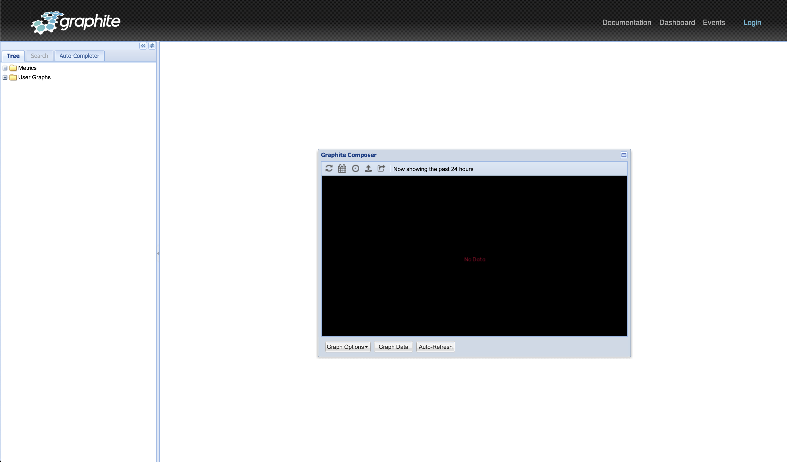

## Requirements

- Connector Development Kit (CDK)
- Docker
- Justfile (Recommended)

## Setup

In order to develop on Graphite Connector, we use Docker with the official
Graphite Image.

If you are using Justfile, use the `dev` command to spin up a Graphite local
instance:

```bash
just dev
```

> **Info** If you are not using Justfile, you can use `docker compose up --build`

When ready you will be able to see the following output

```bash
graphite-connector-graphite-1  | 05/07/2023 17:14:05 :: [console] Starting factory CarbonClientFactory(127.0.0.1:2004:None)
graphite-connector-graphite-1  | 05/07/2023 17:14:05 :: [clients] CarbonClientFactory(127.0.0.1:2004:None)::startedConnecting (127.0.0.1:2004)
graphite-connector-graphite-1  | 05/07/2023 17:14:05 :: [clients] CarbonClientProtocol(127.0.0.1:2004:None)::connectionMade
graphite-connector-graphite-1  | 05/07/2023 17:14:05 :: [clients] CarbonClientFactory(127.0.0.1:2004:None)::connectionMade (CarbonClientProtocol(127.0.0.1:2004:None))
graphite-connector-graphite-1  | 05/07/2023 17:14:05 :: [clients] Destination is up: 127.0.0.1:2004:None
graphite-connector-graphite-1  | down: brubeck: 1s, normally up, want up
graphite-connector-graphite-1  | run: carbon: (pid 74) 5s; run: log: (pid 73) 5s
graphite-connector-graphite-1  | run: carbon-aggregator: (pid 72) 5s; run: log: (pid 71) 5s
graphite-connector-graphite-1  | down: carbon-relay: 1s, normally up, want up; run: log: (pid 64) 5s
graphite-connector-graphite-1  | down: collectd: 1s, normally up, want up
graphite-connector-graphite-1  | run: cron: (pid 62) 5s
graphite-connector-graphite-1  | down: go-carbon: 1s, normally up, want up
graphite-connector-graphite-1  | run: graphite: (pid 59) 5s
graphite-connector-graphite-1  | run: nginx: (pid 61) 5s
graphite-connector-graphite-1  | down: redis: 1s, normally up, want up
graphite-connector-graphite-1  | run: statsd: (pid 70) 5s; run: log: (pid 69) 5s
```

Visit `http://localhosh:12345` in your browser to access the Dashboard.

<div align="left">
  
</div>

### Clean Up

```bash
just stop
```

> **Info** If you are not using Justfile, you can use `docker compose down`

### Mapped Ports

Host  | Container | Service
----- | --------- | -------------------------------------------------------------------------------------------------------------------
12345 |        80 | [nginx](https://www.nginx.com/resources/admin-guide/)
2003  |      2003 | [carbon receiver - plaintext](http://graphite.readthedocs.io/en/latest/feeding-carbon.html#the-plaintext-protocol)
2004  |      2004 | [carbon receiver - pickle](http://graphite.readthedocs.io/en/latest/feeding-carbon.html#the-pickle-protocol)
2023  |      2023 | [carbon aggregator - plaintext](http://graphite.readthedocs.io/en/latest/carbon-daemons.html#carbon-aggregator-py)
2024  |      2024 | [carbon aggregator - pickle](http://graphite.readthedocs.io/en/latest/carbon-daemons.html#carbon-aggregator-py)
8080  |      8080 | Graphite internal gunicorn port (without Nginx proxying).
8125  |      8125 | [statsd](https://github.com/etsy/statsd/blob/master/docs/server.md)
8126  |      8126 | [statsd admin](https://github.com/etsy/statsd/blob/master/docs/admin_interface.md)

> Based on [Mapped Ports section from `graphite-project/docker-graphite-statsd`][1] project

### Volumes

The in-container directory `/opt/graphite/conf` is mapped to host's
`.graphite/conf` directory to allow inspecting graphite's configuration files.

This is relevant when sending events to Graphite via AMQP given that the
variable `AMQP_METRIC_NAME_IN_BODY` determines the format of the message to
send to Graphite via AMQP. [Read more on `Feeding In Your Data`][2].

[1]: https://github.com/graphite-project/docker-graphite-statsd/tree/276a5231d1fa5ab037adfb48abf9f971100e15bf#mapped-ports
[2]: https://graphite.readthedocs.io/en/latest/feeding-carbon.html#using-amqp
